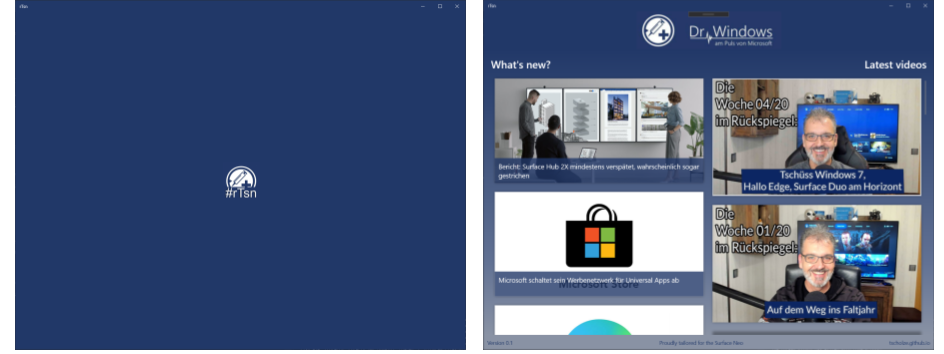

# Road to Surface Duo Xamarin App (#rTsd)
> This is a work in progress [Universal Windows Platform (UWP)](https://dotnet.microsoft.com/apps/xamarin) project which is intended to feature most of the new features that makes the upcoming [Microsoft Surface Neo](https://www.microsoft.com/en-us/surface/devices/surface-neo) unique. It will use the awesome German [Dr. Windows](https://www.drwindows.de)  as data source for its articles.

## tl;dr
This is neither an offical Dr. Windows app nor anything other than a highly motivated playground to dive deep into the modern UWP app ecosystem with a dedicated usecase in mind.
This project is written and owned by a beginner and meant for beginners. It would be perfect if experts could mentor the project - but this is just a mind in the clouds.

If you are looking for the siblings app that's based on Xamarin.Forms to work with the Sutface Duo, please see the GitHub repository [tscholze/xamarin-road-to-surface-duo](https://github.com/tscholze/xamarin-road-to-surface-duo).

## Prerequirements
- Windows 10
- [Visual Studio 2019](https://visualstudio.microsoft.com/)
- Installed UWP Visual Studio plugins

## Other programms I used
- Microsoft [OneNote](https://www.onenote.com/) as information storage around the idea of the app
- Microsoft [Teams](https://products.office.com/en-US/microsoft-teams/group-chat-software) to clarify open question with the Dr. Windows team
- [Visual Studio Code](https://code.visualstudio.com/) for all, except source code editing, writings like mark down files
- [Git Bash](https://git-scm.com/downloads) for Git operations outside of Visual Studio

## Features
- Good looking, hopefully (in my opinion)
- Utilizes Surface Neo features
- Lists articles of [Dr. Windows](https://www.drwindows.de) 
- Lists videos of [Dr. Windows Youtube Channel](https://www.youtube.com/user/DrWindowsTV)
- Detail article view
- Share functionality

## App screenshots

## Caution
Due to the early days of the Surface Neo, there is no emulator or a SDK. I try to update this project with new features until it is actual runable.

## Keep in mind
This app is purely build for having fun! All features have room for improvements or could be done more elegant.

## Contributing
Feel free to improve the quality of the code. It would be great to learn more from experienced C#, Xamarin and Azure developers.
Please use the "default" workflow of contributing to this project.
1. Open an issue and describing your idea or bug finding
1. Fork repository
1. Fix bug / add enhancement in well named feature branch with issue number (e.g. `user.name/2-added-app-icon`)
1. Add the issue number to your commit message (e.g. `#2 Added new app icon`)
1. Create pull request (PR) from your feature branch to this `master` branch 
1. Please keep in touch with your PR to answer upcoming questions
1. If your PR got merged, check if you are listed in the "Authors" section of the readme

## Authors
Just me, [Tobi]([https://tscholze.github.io).

## Links
- [Dr Windows](https://www.drwindows.de) news portal and community

## License
This project is licensed under the MIT License - see the [LICENSE](LICENSE) file for details.
Dependencies or assets maybe licensed differently.
